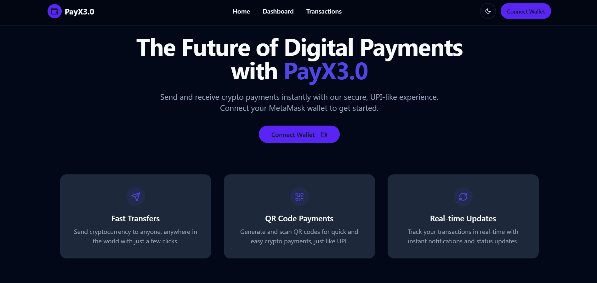
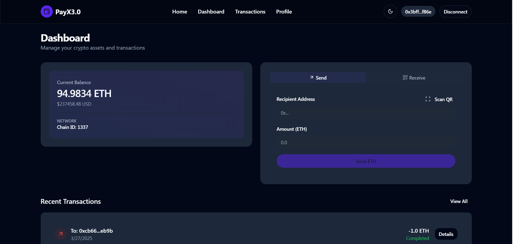
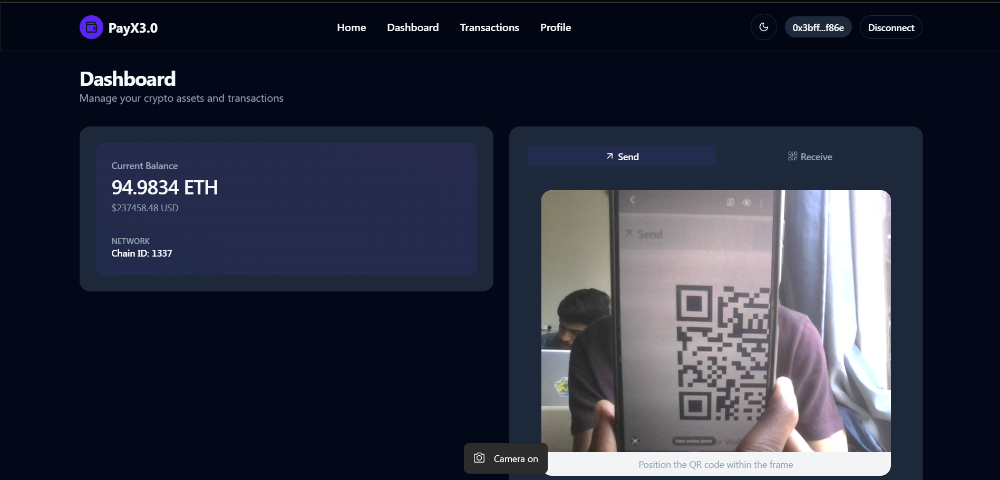
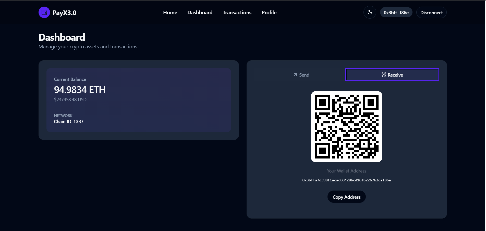
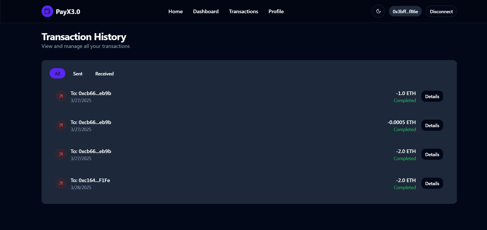
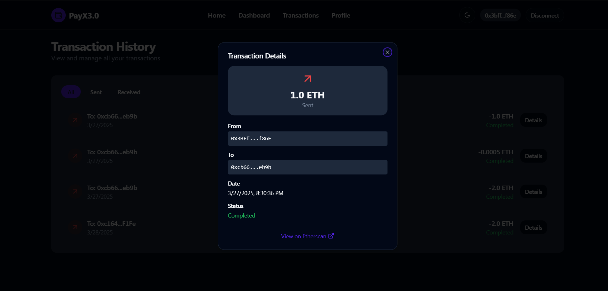
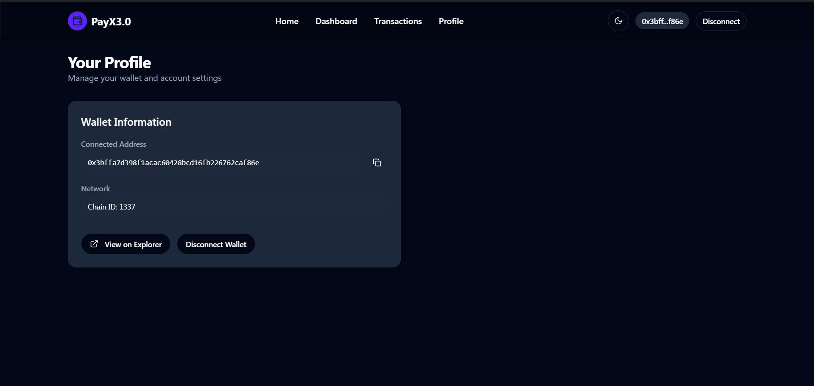

# PayX3.0 - Web3 Payment Application



PayX3.0 is a modern Web3 payment application that enables users to send and receive cryptocurrency transactions using MetaMask wallet integration.

## Features

- 🔐 **Secure Wallet Integration**: Connect with MetaMask
- 💸 **Send/Receive ETH**: Easy cryptocurrency transactions
- 📊 **Transaction History**: Track all your transactions
- 👤 **Profile Management**: Manage your wallet profile
- 🌐 **Multi-Network Support**: Compatible with various Ethereum networks
- 🎨 **Modern UI**: Built with React and Tailwind CSS

## Technology Stack

- Frontend: React.js with TypeScript
- Smart Contracts: Solidity
- Blockchain Integration: ethers.js
- Styling: Tailwind CSS
- Development Environment: Vite
- Smart Contract Development: Truffle

## Screenshots

### Home Page


### Transaction Dashboard


### Send Transaction


### Receive Transaction



### Transaction History


### Transaction Details


### Profile Management


## Getting Started

### Prerequisites

- Node.js (v16 or higher)
- MetaMask browser extension
- Ganache
- Git

### Installation

1. Clone the repository
```bash
git clone https://github.com/mohithn2004/PayX3.0.git
```

2. Install dependencies
```bash
cd PayX3.0
npm install
```

3. Start the development server
```bash
npm run dev
```

4. Deploy smart contracts (in a separate terminal)
```bash
cd Backend
npx truffle migrate --network development
```

### Smart Contract Development

The project uses Truffle for smart contract development. The main contract is located in `Backend/contracts/Transaction.sol`.

To compile and deploy contracts:

```bash
cd Backend
npx truffle compile
npx truffle migrate
```

## Features in Detail

1. **Wallet Connection**
   - Secure MetaMask integration
   - Support for multiple networks
   - Real-time balance updates

2. **Transactions**
   - Send ETH to any address
   - View transaction history
   - Filter transactions (Sent/Received)
   - Transaction details with status

3. **Profile Management**
   - View wallet address
   - Copy address functionality
   - Network information
   - Easy wallet disconnection

## Contributing

Contributions are welcome! Please feel free to submit a Pull Request.

## Acknowledgments

- [Ethereum](https://ethereum.org/)
- [MetaMask](https://metamask.io/)
- [Truffle Suite](https://trufflesuite.com/)
- [React](https://reactjs.org/)
- [Tailwind CSS](https://tailwindcss.com/)

<hr/>
<br/>
Crafted with ❤️ by Mohith N.
